# UX Design Specification Nutricao_stratosTech

**Author:** Diego
**Date:** 2026-03-31

---

<!-- O conteúdo de UX será acrescentado passo a passo no workflow colaborativo -->

## Executive Summary

### Project Vision

**NutriGestão** (nome de trabalho) é um SaaS B2B para nutricionistas que atuam em **instituições** (escolas, hospitais, lares, empresas) e em **atenção clínica** a pacientes. A visão de UX é substituir papel, Excel e WhatsApp por um fluxo único: **campo → conformidade → documentação → cliente**, com automação (dossiê de visita, cascata de custos na ficha técnica, alertas regulatórios) e camadas de informação distintas para profissional, gestor e familiar — sem sacrificar profundidade técnica nem acessibilidade para leigos.

No MVP (web responsiva, sem offline nativo), a experiência deve provar **superioridade clara ao Excel** nos três workflows núcleo: visita com relatório, ficha técnica com custo real, controlo financeiro básico.

### Target Users

| Perfil | Necessidade principal de UX |
|--------|-----------------------------|
| **Nutricionista (Maria)** | Pouco tempo, muito tempo no telemóvel no carro; precisa de agenda clara, visita guiada por checklist, fotos/anotações rápidas, relatório em minutos e troca de contexto entre clientes sem erro. |
| **Gestor / cliente PJ (visão Etapa 1.5+)** | Indicadores e conformidade sem jargão excessivo; sem MVP completo, mas o PRD antecipa semáforos e pacotes para fiscalização. |
| **Paciente / familiar / médico (portal)** | Ver apenas o autorizado; linguagem simples; confiança (LGPD, consentimento explícito). |
| **Admin da plataforma** | Configurar portarias, tenants e métricas com segurança e rastreio. |

Competência digital: profissionais habituados a ferramentas genéricas; a interface deve ser **previsível** (padrões web sólidos), com ajuda contextual onde a legislação exigir campos obrigatórios.

### Key Design Challenges

1. **Densidade informacional vs. velocidade de campo** — Checklists regulatórios, fotos por item, não-conformidades recorrentes e relatório final competem com pouca atenção e ecrã pequeno; priorizar hierarquia, progresso visível e estados de “rascunho vs. concluído”.
2. **Multi-contexto sem perda de contexto** — Um profissional salta entre estabelecimentos e pacientes; o sistema deve deixar **sempre claro** “quem é o cliente ativo” e evitar vazamento visual de dados entre tenants (reforço cognitivo além do técnico RLS).
3. **Ficha técnica e financeiro** — Cascata de custos e recálculos precisam de **feedback imediato** (<10s NFR) e mensagens compreensíveis quando algo bloqueia (ingrediente em falta, margem inválida).
4. **Portal externo e confiança** — Consentimento granular, linguagem acessível e sensação de segurança (saúde) sem sobrecarregar o fluxo do nutricionista que configura permissões.
5. **MVP sem offline** — Expectativa de “app no bolso” deve ser gerida: indicar dependência de rede onde crítico; preparar padrões visuais que mais tarde suportem PWA/offline (Etapa 2).

### Design Opportunities

1. **Dashboard por tópicos e urgência** — Separar “pacientes / institucional” vs. “financeiro”, ordenar por prioridade e countdown regulatório; tornar o primeiro ecrã após login **acionável em menos de 30 segundos** (alinhado ao brainstorming e PRD).
2. **Guided compliance** — Portaria e campos obrigatórios como “assistente”, não formulário estático: menos medo de erro e menos consulta externa à legislação.
3. **Momentos de delight contidos** — Preview/aprovação do relatório de visita, PDF gerado de forma visível; confirmações claras após ações destrutivas ou envio de dados sensíveis.
4. **Profundidade em camadas** — Mesmo dado técnico (ex.: não-conformidade) com vista resumida para gestor e detalhe para nutricionista, preparando o terreno para portal PJ avançado.

---

*Síntese baseada em: PRD, `architecture.md`, brainstorming e relatório de implementation readiness.*

## Core User Experience

*Consolidado após Party Mode e fecho da elicitação avançada ([x]: texto base do Passo 3 + reforços acordados em discussão multi-perspetiva).*

### Defining Experience

O produto gira em torno de um **loop profissional**: **preparar → executar visita técnica com checklist regulatório e evidências (fotos, notas) → gerar e rever relatório → partilhar/arquivar**, com o sistema a compilar o dossiê e a destacar não-conformidades recorrentes. Em paralelo — mesmo valor de negócio — o profissional **mantém fichas técnicas com custo real** (ingredientes, TACO, margem) e um **dashboard** que prioriza urgência (regulatório, financeiro, pacientes).

**Experiência definidora #1 (headline do MVP):** *“Fechar uma visita com relatório credível em poucos minutos, sem ferramentas externas.”* Se isto falhar, o resto (ficha técnica, portal, admin) perde adesão.

**Co-primário (trial e segmentos):** utilizadores que **entram primeiro pela ficha técnica** precisam de uma **vitória rápida** equivalente — por exemplo **primeira receita com preço por porção** calculado e compreensível, sem planilha. Isto é **segundo loop** de ativação; a hierarquia de priorização de UI e onboarding deve manter a visita como #1 sem ignorar este caminho.

**Tom emocional alvo:** **controlo** (sei o que falta e o que está em risco) e **credibilidade profissional** (relatório e números apresentáveis a cliente ou fiscalização).

### Platform Strategy

- **MVP:** aplicação **web responsiva** (um codebase); **mobile-first** nas jornadas de campo; **desktop** aceite para tarefas densas (ficha técnica, revisão de relatórios longos).
- **Input:** toque e teclado; formulários longos devem ser usáveis com **teclado** e leitura confortável em **larguras estreitas**.
- **Capacidades do dispositivo:** **câmara** e, quando aplicável, **geolocalização** via APIs do browser; pedir permissões com contexto claro.
- **Offline:** **fora do MVP** (conforme PRD); a UX deve **não simular** app nativo offline; comunicar dependência de rede onde for crítico; preparar evolução para Etapa 2 (PWA) sem comprometer escopo atual.
- **Geração assíncrona (PDF):** alinhada a fila/worker na arquitetura — a interface **nunca** deve parecer “travada” sem explicação: estados *a gerar*, progresso, conclusão e **erro recuperável** (repetir, contactar suporte).
- **Falha de rede em campo:** mensagens explícitas quando foto ou gravação não sincroniza (evitar parecer bug da aplicação).
- **Portal** (familiar/médico): mesma stack web; prioridade secundária ao fluxo do nutricionista no MVP.

### Effortless Interactions

- **Checklist certo no sítio certo:** carregar modelo por portaria/estabelecimento e destacar pendências da última visita sem o utilizador procurar legislação.
- **Evidência ligada ao item:** foto/nota associada ao ponto do checklist, não “álbum solto”.
- **Relatório como consequência:** ao concluir, **preview** do dossiê e ação clara (aprovar, ajustar texto, exportar PDF, enviar email).
- **Contexto sem erro:** troca de cliente/estabelecimento com **estado sempre visível** (quem está “ativo”).
- **Cascata de custos:** alterar preço de ingrediente e ver **propagação** com feedback de progresso/erro compreensível.
- **Menos passos que Excel:** importação CSV no onboarding; evitar duplicar dados entre módulos.

### Critical Success Moments

- **Primeiro “uau”:** gerar o **primeiro relatório de visita completo** e sentir que substitui email+Word+anexos.
- **Vitória na ficha técnica (trial):** primeira receita com **preço por porção** e totais coerentes sem folha de cálculo.
- **Momento de confiança:** ver **alerta regulatório com countdown** e perceber que não vai esquecer prazos.
- **Momento financeiro:** ver **status de pagamentos** e renovações sem planilha paralela.
- **Ponto de rutura:** dúvida sobre **qual tenant/cliente** está aberto, ou perda de fotos/notas — falha grave de UX.
- **Portal:** primeiro acesso de familiar com **consentimento** claro e dados legíveis (sem jargão clínico excessivo).

### Experience Principles

1. **Campo primeiro** — O ecrã de trabalho em visita ganha prioridade de hierarquia, performance e simplicidade.
2. **Compliance como guia** — Campos obrigatórios e portarias aparecem como **orientação**, não como punição; erros são corrigíveis com mensagens específicas.
3. **Um contexto ativo, sempre** — Nome do cliente/estabelecimento (e papel) visível nas áreas autenticadas; reduz erro e ansiedade.
4. **Feedback imediato em números** — Cascata, totais e bloqueios mostram **o quê** falhou e **onde** corrigir.
5. **Honestidade de plataforma** — Não prometer offline ou “app” no MVP; dependência de rede e tempos de PDF assíncronos transparentes.
6. **Assíncrono visível** — Jobs em fila (PDF, email) com estado perceptível e recuperação clara.

## Desired Emotional Response

### Primary Emotional Goals

- **Profissional (nutricionista):** **Alívio e controlo** — “Isto substitui o caos do papel e do Excel”; **competência percebida** ao entregar relatório ou números de custo ao cliente.
- **Diferenciação vs. concorrentes:** **Confiança sem sobrecarga** — a legislação aparece como apoio, não como medo constante; **produtividade** sem sensação de “mais um sistema pesado”.
- **Após o objetivo principal (relatório / ficha fechada):** **Orgulho e leveza** — tarefa encerrada, documentação defensável, menos culpa por esquecer prazos.
- **Portal (familiar / médico):** **Tranquilidade e clareza** — entendem o essencial sem pânico; **confiança** no cuidado e na privacidade (LGPD visível, não assustadora).

### Emotional Journey Mapping

| Fase | Estado emocional desejado | Notas de UX |
|------|---------------------------|-------------|
| **Descoberta / trial** | Curiosidade + ceticismo saudável | Onboarding rápido até primeira vitória (visita ou ficha); evitar “tour” longo sem resultado. |
| **Primeiro uso real** | Foco, pouca ansiedade | Checklist guiado, contexto ativo claro; erros com mensagem acionável. |
| **Core (visita em campo)** | Fluxo, urgência canalizada | Poucos passos até foto/nota; progresso visível; sem culpa por pausar (rascunho). |
| **Após concluir tarefa** | Satisfação, desejo de repetir | Preview do relatório, confirmação de envio/armazenamento; celebrar discretamente (não infantil). |
| **Algo corre mal** | Frustração **contida** → **recuperação** | Nunca “morreu silenciosamente”; explicar rede, fila PDF, permissão de câmara; próximo passo óbvio. |
| **Regresso (utilização habitual)** | Familiaridade, eficiência | Dashboard com urgências; menos surpresas negativas nas rotas frequentes. |

### Micro-Emotions

Prioridade para o sucesso do produto:

- **Confiança** > ceticismo (dados de saúde e conformidade).
- **Competência** > confusão (jargão só onde necessário; tooltips e camadas).
- **Alívio** > ansiedade (countdown e alertas como “parceiro”, não alarme vazio).
- **Realização** > frustração (fecho de visita e números da ficha como vitória tangível).
- **Satisfação estável** > “delight” forçado — healthcare B2B favorece **seriedade calorosa** e previsibilidade.

Evitar deliberadamente: **vergonha** por não saber legislação, **pânico** por dúvida de tenant, **desconfiança** por copy vaga sobre dados, **cinismo** (“mais um PDF que ninguém lê”) — combater com preview útil e partilha clara.

### Design Implications

| Emoção alvo | Abordagem de UX |
|-------------|-----------------|
| Controlo | Hierarquia forte, estado do sistema (sync, PDF, tenant), dashboard acionável. |
| Confiança | Consentimento explícito no portal; linguagem humana em erros; audit trail sentido sem expor complexidade desnecessária. |
| Alívio | Campos obrigatórios com “porquê”; alertas com data e ação sugerida. |
| Competência | Relatórios e PDFs com aspeto profissional consistente; números da ficha auditáveis (de onde veio cada total). |
| Recuperação em falha | Ilustrações mínimas; texto que isola causa (rede vs. servidor vs. permissão); botão de repetir / guardar rascunho. |

### Emotional Design Principles

1. **Seriedade sem frieza** — Saúde e regulamentação pedem tom **profissional e acolhedor**, não lúdico demais.
2. **Antecipar culpa** — O sistema assume a carga cognitiva da conformidade; o utilizador não deve sentir que “falhou” por não decorar portarias.
3. **Transparência emocional** — Quando algo demora (PDF, rede), a interface **reconhece a espera** — reduz raiva e abandono.
4. **Respeito pelo tempo** — Cada ecrã deve responder à pergunta implícita: *“O que faço a seguir e quanto falta?”*
5. **Dignidade no portal** — Familiares não são “utilizadores secundários de segunda”: linguagem clara, sem infantilizar paciente.

## UX Pattern Analysis & Inspiration

*Nota:* Não houve lista explícita de “apps favoritos” do stakeholder; a análise baseia-se em **hábitos reais** do público-alvo (calendário, WhatsApp, Excel/planilhas), nos **concorrentes do PRD** e em **SaaS B2B / saúde** com padrões maduros. Podes substituir ou acrescentar marcas nas próximas revisões.

### Inspiring Products Analysis

| Fonte / arquétipo | O que resolve bem | Lição para NutriGestão |
|-------------------|-------------------|-------------------------|
| **Calendário (Google / Apple)** | Agenda do dia legível, eventos por cor, lembretes | Dashboard “o que importa hoje” e visitas por prioridade; countdown regulatório como “evento crítico”. |
| **Excel / Google Sheets** | Confiança nos números, fórmulas visíveis, sensação de controlo | Ficha técnica e cascata devem **mostrar de onde vêm os totais** (rastreabilidade), não caixa preta. |
| **WhatsApp** | Baixa fricção para partilhar e confirmar | Partilha de relatório / resumo com estados claros (enviado, falhou, reenviar); sem copiar grupos caóticos como modelo de arquivo. |
| **Nutrium / apps clínicos (referência PRD)** | Prontuário, paciente no centro, apps móveis | Portal e dados do paciente com hierarquia clara; mobile-first em consulta de dados, não só em visita. |
| **Food Checker / ERP alimentar (referência PRD)** | Checklist e conformidade como fluxo de trabalho | Itens de checklist como **tarefas completáveis** com evidência ligada, não PDF estático. |
| **Linear / Jira (modo simples)** | Estados, filtros, “inbox” de trabalho | Pendências de visita, não-conformidades recorrentes e tarefas pós-visita como fila acionável. |
| **Stripe / dashboards financeiros B2B** | Status de cobrança, linha do tempo, poucos KPIs | Módulo financeiro: estados (ok / em risco / vencido) sem poluir com gráficos desnecessários no MVP. |

### Transferable UX Patterns

**Navegação e hierarquia**

- **Context switch explícito** (equivalente a mudar de “conta” ou “projeto”) — alinha com *um tenant/cliente ativo sempre visível*.
- **Navegação por tarefas** (“Hoje”, “Alertas”, “Pendentes”) em paralelo à navegação por módulo (Visitas, Fichas, Financeiro).

**Interação**

- **Checklist com progresso** (percentagem ou passos) — reduz ansiedade em visitas longas.
- **Captura inline** (foto/anexo no próprio item) — modelo de apps de inspeção / field service, evita galeria desassociada.
- **Preview antes de commit** (relatório, PDF) — padrão de “rever antes de enviar” de email e contratos.

**Visual**

- **Tipografia legível e contraste** (WCAG AA no PRD) — prioridade sobre estética “modinha”.
- **Cor com significado funcional** (semáforo de conformidade / pagamento) — usar com legenda e não só cor (acessibilidade).

### Anti-Patterns to Avoid

- **ERP “tudo em árvore”** — menus profundos que matam o uso no telemóvel entre visitas.
- **Formulário gigante sem secções** — checklist regulatório precisa de **chunking** e salvamento explícito de rascunho.
- **Modais empilhados** — especialmente em mobile; preferir painéis de página completa ou *drawers* com uma tarefa clara.
- **Notificações agressivas** — alertas são parceiros de conformidade, não alarme constante sem ação.
- **Jargão legal em cima de tudo** — LGPD e termos necessários, mas **isolados** em momentos de consentimento, não como parede no primeiro login.
- **Loading sem contexto** — “A carregar…” infinito em PDF ou upload de foto destrói confiança (ligação ao Passo 3: assíncrono visível).
- **Duplicar o Excel** — se a ficha técnica parecer planilha sem guia, perde-se o diferencial de produto.

### Design Inspiration Strategy

**Adotar**

- Agenda/dashboard do dia como **ponto de entrada emocional** (alívio + controlo).
- Checklist + evidência + preview de relatório como **pipeline único** (field service maduro).
- Estados financeiros legíveis (poucos, consistentes).

**Adaptar**

- Padrões tipo Notion/blocks **apenas onde** ajudam (notas livres, anotações); **não** substituir campos regulatórios obrigatórios por blocos livres sem validação.
- Densidade “tipo planilha” na ficha técnica com **linhas zebra, cabeçalhos fixos** em desktop e **cartões** em mobile.

**Evitar**

- Gamificação exagerada (emoji, streaks) — conflita com seriedade saúde/LGPD.
- Dark patterns em trial ou partilha de dados do paciente.
- Paridade cega com um único concorrente — o diferencial é **clínico + institucional** unificado; a UX deve refletir os dois eixos sem parecer dois produtos colados sem articulação.

### Referências visuais do stakeholder (layout shell)

**Fonte:** *Fitness Pro* (dashboard de exemplo) — uso como **referência de composição e componentes**, não de domínio (fitness vs. nutrição institucional/clínica). A paleta e ilustrações devem ser **adaptadas** na Fase visual (Passo 8) para tom B2B saúde: profissional, WCAG AA, sem aparência “app de ginásio” na marca final.

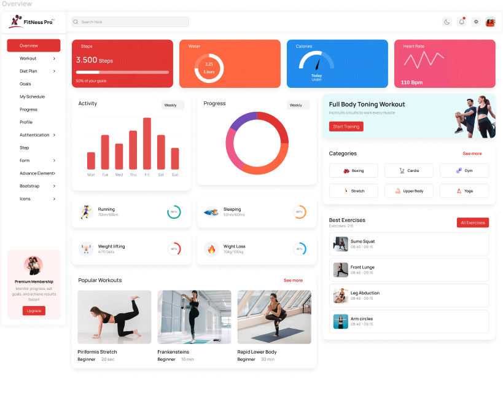

**O que retirar (decisões explícitas do Diego):**

| Elemento | Diretriz para NutriGestão |
|----------|---------------------------|
| **Barra lateral fixa** | Navegação principal à esquerda (desktop); em mobile, equivalente com **drawer / bottom nav** para não perder os módulos (Visitas, Clientes, Fichas, Financeiro, Portal…). |
| **Cards com cantos bem arredondados** | Aplicar aos **painéis do dashboard**, resumos e blocos de métricas; definir *radius* único no design system (ex. `rounded-xl` / 12–16px) para consistência. |
| **Estilo dos gráficos** | Gráficos **limpos**, com cartões coloridos por KPI, barras/donut/gauge como no exemplo — mapear para indicadores reais: visitas, conformidade, cascata, financeiro (cores semânticas + legenda). |
| **Cards pequenos com indicadores** | Fileira superior ou grelha de **mini-KPIs** (ex.: alertas regulatórios, visitas hoje, pendências financeiras); cada card: valor grande, label, opcional progresso. |
| **Home em 2 colunas** | Área principal **larga à esquerda** (gráficos, lista prioritária, agenda); **coluna mais estreita à direita** (destaques, atalhos, “próximos passos”, resumo de alertas). Em *breakpoint* estreito: empilhar (1 coluna). |

**A validar no Passo 8 (Visual foundation):** tokens de cor primária (o vermelho do exemplo é opcional; pode migrar para verde-azulado “saúde” ou outra paleta aprovada), sombras e densidade para **modo campo** no telemóvel.

### Experimento de layout — candidatas para o dashboard (overview)

**Objetivo:** testar composições com **o mesmo conjunto de informações da aplicação** (KPIs, listas, gráficos, atalhos alinhados ao PRD), comparar **baseline vs. família alternativa** e, dentro da alternativa, **duas telas no mesmo estilo** (var. 1 e var. 2) para decidir shell de *home* / overview — ou fundir elementos.

| Candidata | Ficheiro | Carácter |
|-----------|----------|----------|
| **A (baseline stakeholder)** | `fitness-pro-dashboard-reference.png` | Sidebar, grelha clara, duas colunas, cartões pastéis e gráficos no estilo já descrito acima (*Fitness Pro*). |
| **B — var. 1 (contraste + carrossel)** | `dashboard-nutrition-cards-dark-analytics-reference.png` | Fundo cinza claro; **painel “Analytics overview” escuro** (carvão) com **carrossel** de cartões verticais em acentos (mostarda, verde, azul, laranja); **Progress tracker** com cartões horizontais e micro-gráficos; lista tipo **receitas / itens**; **calorias** com barras por dia da semana e cartões de refeição. |
| **B — var. 2 (*split* hero, mesmo estilo)** | `dashboard-nutrition-split-navy-yellow-reference.png` | **Meio superior navy** (~`#122023`), **inferior branco**; acento **amarelo** (~`#FCD12A`) e verdes; cabeçalho escuro com pesquisa, “Download report”, perfil. **Topo:** cartão amarelo grande (KPI principal) + ícones circulares de macros; ao lado, **gráfico de linha** com gradiente e lista refeições. **Base (3 colunas):** *gauge* semicircular “calorias hoje”, **barras horizontais** % (calorias, proteínas, hidratos), **lista de receitas** com *tags* Carb/Fats/Protein e estado selecionado (borda amarela). |

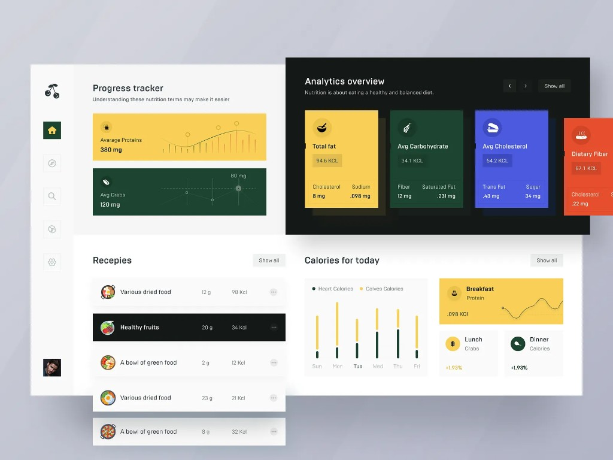

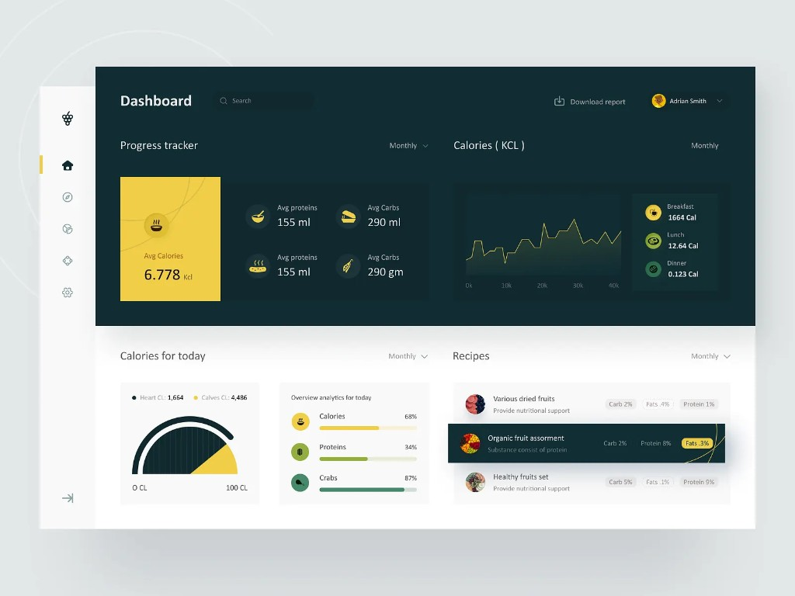

**Como correr o experimento:** *wireframes* ou protótipos com **os mesmos widgets** (alertas regulatórios, visitas hoje, pendências financeiras, atalhos). Sugestão de comparação: **A vs. B** (qual família?) e, se B ganhar tração, **B var. 1 vs. B var. 2** (carrossel *vs.* *split* + gauge). Registar preferência, tempo de *scan* e clareza do “próximo passo”.

**Notas de adaptação a NutriGestão:** tratar os mocks como **hierarquia e ritmo**, não copy nem unidades literais (ex.: “Kcl”, placeholders duplicados nos mocks). Painéis escuros: validar **WCAG AA**. Remapear amarelo/verde/navy para **tokens semânticos** do design system (urgência, OK, superfície escura primária).

### Referência visual — Cardápios por estabelecimento (lista editável)

**Ecrã-alvo:** listagem de **cardápios disponíveis** para **edição no contexto de um estabelecimento** (tenant + cliente + estabelecimento ativo sempre visível no cabeçalho ou *breadcrumb*).

**Fonte visual:** exemplo *Diet Menu* (mesma família *Fitness Pro*) — usar como **padrão de layout e densidade**, não como copy literal de “Health Score” ou ginásio.

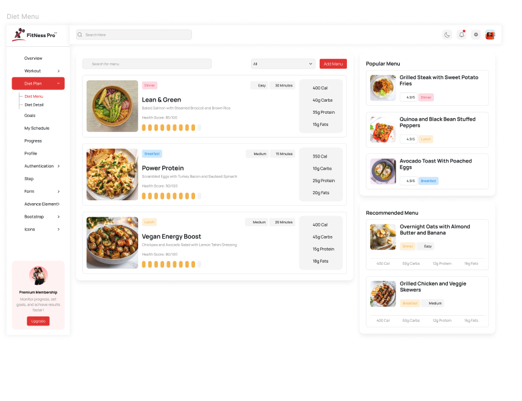

| Zona (referência) | Adaptação NutriGestão |
|-------------------|------------------------|
| **Header global** | Pesquisa global (opcional) + contexto do estabelecimento + ações de utilizador. |
| **Barra de ferramentas da lista** | **Busca** (“Pesquisar cardápio / ciclo / período”), **filtro** (ex.: turno, faixa etária, estado rascunho/publicado), botão primário **“Novo cardápio”** ou **“Duplicar modelo”**. |
| **Coluna principal (larga)** | **Cards horizontais** por cardápio: miniatura (opcional — prato representativo ou ícone), **nome**, período/refeições cobertas, **tags** (ex.: “Escolar”, “Lar”, “Hospitalar”), metadados (última edição, responsável). Painel lateral no card para **resumo nutricional** ou **indicadores-chave** (macros, alergénios pendentes) em vez de “score” lúdico. |
| **Coluna direita (estreita)** | Secções tipo **“Usados recentemente”**, **“Modelos”**, **“Sugeridos”** (regras do sistema ou portaria) para **navegação rápida** sem perder a lista principal. |
| **Duas colunas** | Desktop: manter **2 colunas** para agilizar *scan* + atalhos; **tablet**: coluna direita colapsável ou *tabs*; **mobile**: lista primeiro, painel secundário em *bottom sheet* ou segundo ecrã. |
| **Edição** | Cada card com CTA claro **“Editar”** / menu de contexto (duplicar, arquivar, exportar); fluxo de edição detalhada no Passo 10 (jornadas). |

**Ligação ao PRD:** cardápios escolares e listas de compras aparecem com mais detalhe na **Etapa 1.5**; no MVP, esta planta serve **qualquer catálogo semelhante** (cardápios/planos de refeição por estabelecimento) para não redesenhar a página quando o escopo crescer.

**Mapeamento técnico (futuro):** rota sugerida na arquitetura sob `(dashboard)/establishments/[id]/menus` ou equivalente — a definir na estrutura de rotas na implementação.

### Referência visual — Criação / edição da ficha técnica do prato

**Ecrã-alvo:** página de **criação ou edição** de **ficha técnica de receita/prato** (ingredientes por peso, TACO, fatores de correção/cocção, custos, impostos, margem, **preço por porção**, informação nutricional por porção, escalonamento), alinhada ao módulo **Ficha Técnica** do PRD.

**Fonte visual:** exemplo *Diet Detail* (*Fitness Pro*) — **estrutura em duas colunas** (~2/3 + 1/3): narrativa e preparo à esquerda; **dados numéricos e lista de ingredientes** à direita. Adaptar conteúdo a **contexto profissional** (sem ratings de utilizador tipo app de receitas, salvo futuro portal).

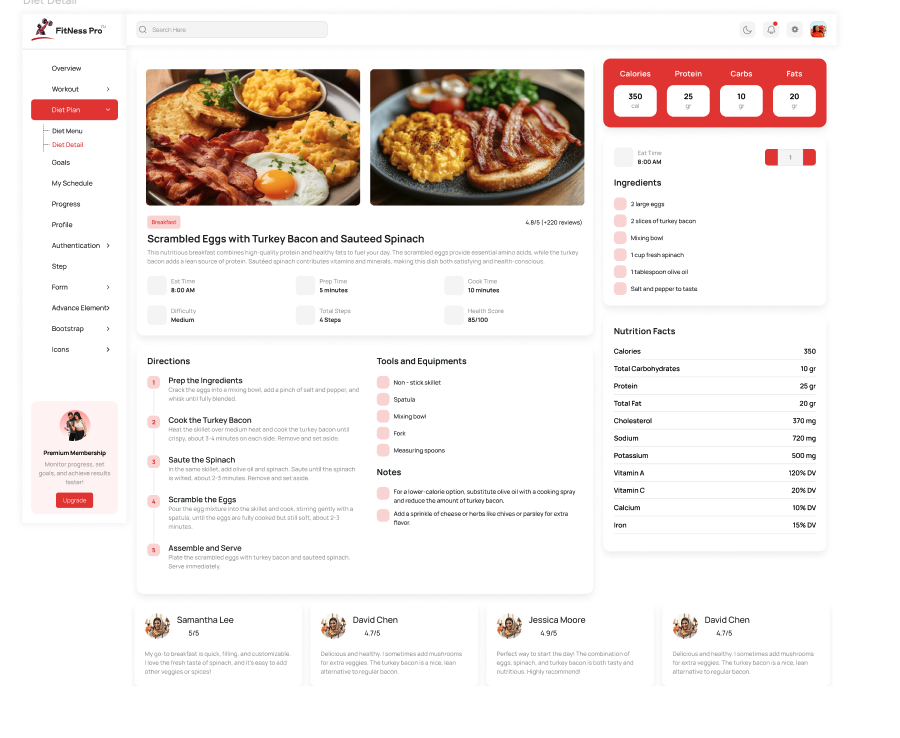

| Zona (referência) | Adaptação NutriGestão |
|-------------------|------------------------|
| **Topo / hero** | Nome da receita, categoria (refeição / contexto institucional), foto opcional; **substituir “rating”** por estado (rascunho, validado) ou ligação ao estabelecimento. |
| **Indicadores rápidos (6 mini-cards)** | Mapear para: **tempo prep / cocção**, **nº porções**, **dificuldade operacional** (opcional), **passos de preparo**, e métricas do PRD: **custo total / preço por porção** ou **margem %** — evitar “Health Score” genérico; preferir **resumo nutricional por porção** ou **conformidade TACO** se útil. |
| **Coluna esquerda — Preparo** | **Modo de preparo** numerado; **equipamentos** (cozinha industrial vs. doméstico); **notas** (HACCP, observações de produção). |
| **Coluna direita — Macros (header colorido)** | **Valores nutricionais por porção** (kcal, P, L, CHO) com origem **TACO** / cálculo; destacar atualização quando ingredientes mudam (feedback de cascata). |
| **Lista de ingredientes** | **Quantidade + unidade + ingrediente** com vínculo à **matéria-prima** e **custo unitário**; controlos para **fator de correção/cocção** por linha se o modelo de dados assim o exigir; stepper da referência → **input numérico** + seletor de unidade. |
| **Tabela “Nutrition Facts”** | Micronutrientes e % VDR **por porção** (quando no escopo); colapsável se densidade for alta no mobile. |
| **Secção inferior (reviews na referência)** | **Não usar** como avaliações sociais no MVP; substituir por **histórico de versões**, **auditoria** (quem alterou custo), ou **alertas** (ex.: alergénio não declarado). |

**Comportamento UX (PRD):** mostrar **de onde vêm os totais** (rastreabilidade); ao alterar preço de ingrediente, **feedback de recálculo** (<10s NFR) na própria página ou *toast* + refresh dos campos afetados.

**Responsive:** desktop = 2 colunas; **mobile** = secções empilhadas sugeridas: (1) identidade + ações, (2) ingredientes + custos, (3) preparo, (4) nutrição expandida.

**Rota sugerida:** `(dashboard)/technical-sheets/recipes/[id]` ou aninhada por estabelecimento — a fechar com a estrutura de dados multi-tenant.

### Referência visual — Agendamento de visitas

**Ecrã-alvo:** **calendário / agenda de visitas técnicas** (agendar, reprogramar, ver conflitos, saltar para o dia), alinhado ao módulo **Visitas Técnicas** do PRD (agendamento, execução com checklist, relatório).

**Fonte visual:** *My Schedule* (*Fitness Pro*) — **grelha semanal** + **vistas** (mês / semana / dia / lista) + **legenda por tipo** + **coluna direita** com resumos e mini-calendário.

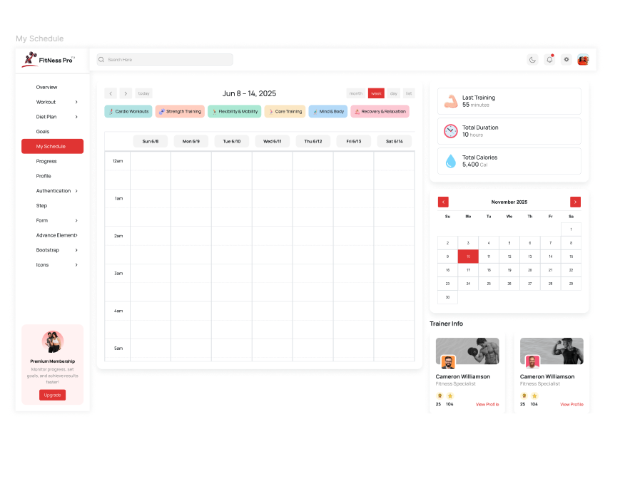

| Zona (referência) | Adaptação NutriGestão |
|-------------------|------------------------|
| **Controlos de vista** | **Mês | Semana | Dia | Lista**; botão **Hoje**; setas anterior/seguinte; opcional filtro por **estabelecimento** ou **cliente** no cabeçalho da página. |
| **Legenda / filtros coloridos** | Tipos de evento: ex. **Visita técnica**, **Revisão**, **Consulta paciente**, **Interno** — cores pastéis + ícone; clicar filtra a grelha (acessível: não só cor, também texto). |
| **Grelha horária** | Blocos de **visita** com nome do estabelecimento, duração, estado (confirmada / rascunho); *drag* opcional na Etapa 2; MVP pode ser **clique para criar/editar**. |
| **Coluna direita — resumo** | Substituir “treino/calorias” por **métricas do período**: visitas concluídas, **pendentes regulatórias** (countdown), tempo total em campo (opcional). |
| **Mini-calendário** | Navegação rápida de data; dia atual destacado; dias com visita com **marcador** (ponto ou fundo suave). |
| **Secção tipo “Trainer Info”** | Mapear para **próxima visita** ou **estabelecimentos do dia**: card com nome, tipo, link **“Abrir ficha”** / **“Iniciar visita”** — sem rating de estrelas no MVP. |

**Integração com fluxo:** a partir de um bloco, CTA **“Iniciar visita”** leva ao modo execução (checklist + fotos); **“Ver detalhe”** abre painel lateral ou página de visita. **Duplo clique** no compromisso pode abrir **modal** com resumo (tipo de visita, profissional atribuído, notas) e atalhos — complementar ao painel lateral em desktop.

**Mobile:** vista **Lista** ou **Dia** por defeito; grelha semanal compacta ou só após *landscape*; mini-calendário em *bottom sheet* ou topo colapsável.

**Rota sugerida:** `(dashboard)/visits` ou `(dashboard)/visits/schedule` — consistente com `architecture.md` (`visits/`).

### Referência visual — Dashboard detalhado (gráficos: barras, linhas, donut)

**Ecrã-alvo:** **dashboard analítico** do profissional — visão **mais densa** que o *overview* inicial, com **vários tipos de gráfico** e **cartões pastéis** de indicadores. Alinha ao PRD (**FR50–FR54**): agenda do dia, alertas regulatórios com countdown, pendências financeiras, separação por tópicos (pacientes vs. financeiro / institucional).

**Fonte visual:** página *Progress* (*Fitness Pro*) — **grelha multi-coluna**, topo com resumo + filtro de período (“This Week”), **mix de visualizações**.

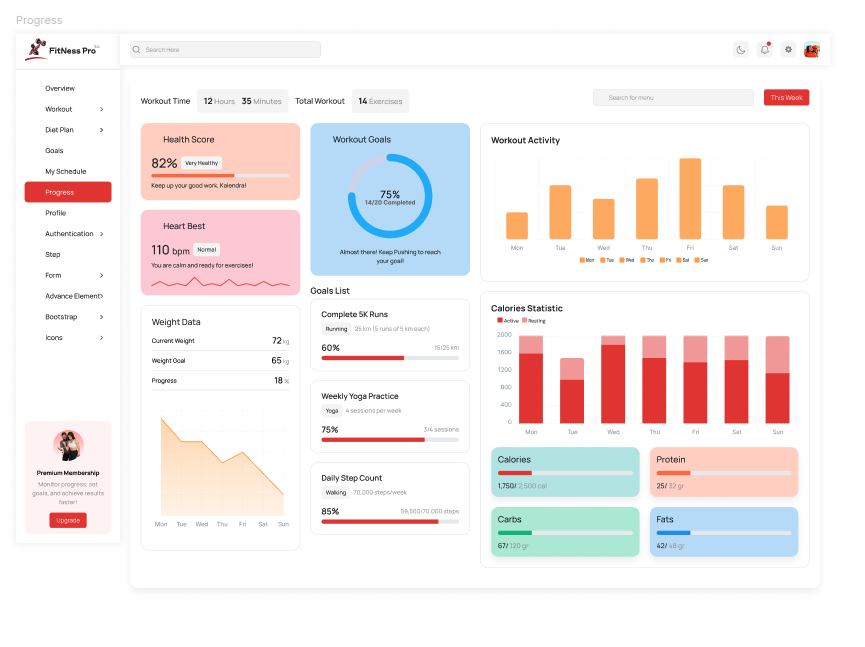

**Inventário de tipos de gráfico na referência → uso sugerido em NutriGestão**

| Tipo (referência) | Uso possível no produto |
|-------------------|-------------------------|
| **Linha** | Tendência temporal: ex. **não-conformidades por mês**, **visitas realizadas**, **evolução de indicador** por estabelecimento (Etapa 1.5+). |
| **Área (área preenchida)** | Mesmo eixo temporal com ênfase em volume acumulado: ex. **carga de trabalho** ou **receitas auditadas**. |
| **Donut / “pizza”** | Proporção de **metas**: ex. % **checklists** concluídos no prazo, **visitas** vs. planeadas, **conformidade** agregada (com legenda e valor central). |
| **Barras verticais** | Comparação **dia a dia** ou **por estabelecimento**: visitas, tempo em campo, tickets abertos. |
| **Barras empilhadas** | Dois componentes no mesmo período: ex. **visitas OK vs. com pendências**, **receitas dentro/fora do custo-alvo** (se dados existirem). |
| **Barras horizontais / progresso** | **Metas operacionais**, prazos regulatórios (% do tempo até vencimento), **onboarding** concluído, **renovações** de contrato. |

**Layout:** manter **sidebar + header** coerentes com as referências anteriores; **colunas de largura variável** (métricas compactas à esquerda, gráficos maiores à direita) — ajustar breakpoints para não esmagar gráficos em tablet.

**Regras de UX**

- **Cada gráfico:** título, **período**, unidade explícita; **cores semânticas** + legenda ou rótulos (WCAG — não depender só da cor).
- **Evitar ruído no MVP:** não replicar todos os widgets de uma vez; priorizar **agenda do dia**, **alertas com countdown**, **pendências financeiras**, depois expandir com donuts/barras conforme dados reais.
- **Filtro de período** (ex.: Esta semana / Mês / Trimestre) no topo da área de gráficos, como na referência.

**Diferença face à primeira referência (*Fitness Pro* overview):** aqui o foco é **densidade analítica** e **biblioteca de padrões de chart** para reutilizar em *dashboard* e, mais tarde, **portal PJ** (Etapa 1.5).

**Rota sugerida:** `(dashboard)/dashboard` ou sub-rota `analytics` se o *home* permanecer mais leve.

### Referência visual — Perfil e preferências (toggles)

**Ecrã-alvo:** área de **perfil do profissional** e **definições da conta**: dados pessoais/profissionais (CRN), **preferências de notificação e alertas**, ativar/desativar **funcionalidades** quando aplicável (ex.: lembretes por email, alertas regulatórios, 2FA em conjunto com fluxo Supabase Auth). Alinha a **Auth + Perfil (FR1–FR5)** e à **Central de alertas** / configurações do PRD e brainstorming.

**Fonte visual:** página *Profile* (*Fitness Pro*) — **grelha de cartões** em várias colunas; cartão destacado com **interruptores (*toggles*)** em lista.

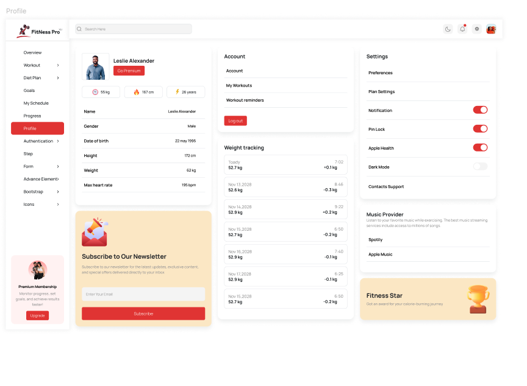

| Zona (referência) | Adaptação NutriGestão |
|-------------------|------------------------|
| **Cartão identidade** | Foto opcional, nome, **CRN**, contacto; CTAs **Editar perfil**, **Alterar palavra-passe** / **Sessão** (Supabase); evitar “Go Premium” literal salvo produto de subscrição definido. |
| **Chips / stats** | Substituir peso/idade por **dados profissionais** resumidos (ex.: nº estabelecimentos ativos, trial/plano) se fizer sentido comercial — ou omitir no MVP. |
| **Lista de dados** | Campos profissionais e de conta com **label | valor** e divisores finos (como na referência). |
| **Cartão “Account” + logout** | Ligações: **Conta**, **Segurança** (2FA), **Sessões**; botão **Terminar sessão** visível e seguro (confirmação opcional). |
| **Cartão toggles (foco)** | Secções **“Notificações”**, **“Alertas”**, **“Preferências”**: cada linha com **rótulo + descrição curta** + *toggle*; estados **on/off** com cor de acento + contraste WCAG; *toggle* com **teclado** e `aria-checked`. |
| **Exemplos de linhas MVP** | Email: resumo diário / alertas críticos; **push** (Etapa 2 / FR66); lembretes de **vencimento de checklist**; **renovação de contrato**; notificações de **relatório gerado**. Desativar o que não existir no backend para não gerar expectativa falsa. |
| **Cartões inferiores (newsletter, música, conquistas)** | **Não replicar** no MVP; substituir por **Suporte / Documentação**, **Exportar dados (FR65)** quando existir, ou **consentimentos LGPD** resumidos com link para política. |

**Comportamento:** ao mudar um *toggle*, **feedback imediato** (guardado / erro); se a alteração for pesada (2FA), **redirecionar** para fluxo dedicado em vez de só um interruptor.

**Mobile:** colunas empilhadas; cartão de toggles em ecrã completo com *sticky* “Guardar” se houver alterações pendentes.

**Rota sugerida:** `(dashboard)/settings/profile` ou `(dashboard)/profile` — alinhado a `architecture.md` e rotas de *settings*.

### Referência visual — Login (duas colunas, sem login social)

**Ecrã-alvo:** **autenticação apenas por email e palavra-passe** (Supabase Auth), com layout **50/50**: formulário à esquerda, **imagem de marca** à direita (full height). **Sem integração com login social** (Google, Apple, Facebook, etc.) — **decisão de produto:** não implementar OAuth no âmbito atual; o **FR2** do PRD fica em backlog / fase futura se for reavaliado. *Magic Link* ou recuperar palavra-passe entram como **links de texto** abaixo do formulário.

**Fonte visual:** *Sign Up* / auth *Fitness Pro* — **adaptar** para **Sign In**: mesma estrutura de colunas, inputs com cantos arredondados, botão primário full-width, rodapé com link para registo.

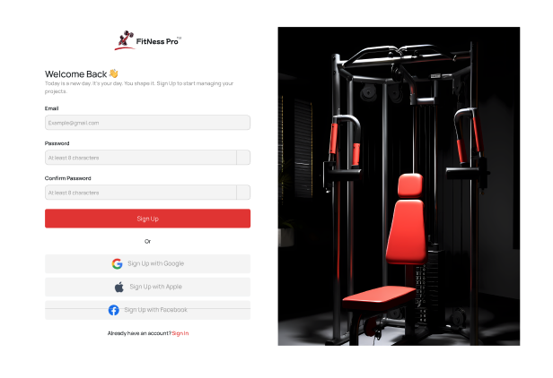

| Elemento | Especificação NutriGestão |
|----------|---------------------------|
| **Coluna esquerda** | Fundo claro; **logo** NutriGestão; título + subtítulo; **Email** e **Palavra-passe** com labels; **mostrar/ocultar** senha; botão primário **Entrar**; **Esqueci a palavra-passe**; **Criar conta** ou **Pedir acesso** conforme fluxo comercial. |
| **Coluna direita** | Imagem institucional **nutrição / saúde / campo**; contraste adequado. |
| **Não implementar** | Separador **“Ou”** com **qualquer botão OAuth** / login social. |
| **Registo (outra rota)** | Mesmo layout de duas colunas; campos extra (CRN, etc.) conforme PRD; **sem** login social. |
| **Acessibilidade** | Foco visível, `autocomplete` adequado, erros sob o campo, CAPTCHA se o PRD exigir. |

**Nota de produto:** segurança reforçada via **2FA (FR3)**, políticas de senha, rate limiting e *magic link* — não via provedores sociais nesta fase.

**Rota sugerida:** `(auth)/login` — grupo público fora do *dashboard* autenticado.

## Design System Foundation

*As referências visuais em `ux-references/` complementam o Passo 5 (inspiração) e informam tokens/cor no **Passo 8 — Visual foundation**.*

### 1.1 Design System Choice

**shadcn/ui** (componentes sobre **Radix UI**) + **Tailwind CSS**, no projeto **Next.js (App Router)**.

- Componentes **copiados para o repositório** (`components/ui/`), não *package* opaco — controlo total para evolução e auditoria.
- **Radix** garante primitivos acessíveis (teclado, foco, `aria`) alinhados ao NFR WCAG AA do PRD.

### Rationale for Selection

| Critério | Por que encaixa |
|----------|-----------------|
| **Arquitetura** | Já decidido: Tailwind + `create-next-app`; `architecture.md` e *Implementation Patterns* assumem esta stack. |
| **Prazo MVP (2 meses)** | Biblioteca madura, documentação ampla; menos tempo em botões/cards do zero. |
| **Referências visuais** | Cards arredondados, *toggles*, inputs, botão primário, grelhas — mapeiam para **Card**, **Switch**, **Input**, **Button**, **Sheet/Dialog**, **Tabs**. |
| **Manutenção** | Equipe ajusta tokens e variantes num só sítio (`tailwind.config`, variáveis CSS do tema). |
| **Gráficos (dashboard detalhado)** | Compor com **Recharts**, **Chart.js** ou blocos *chart* compatíveis com a stack escolhida — decisão fina na primeira story de dashboard (evitar lock-in prematuro). |

### Implementation Approach

1. **`npx shadcn@latest init`** em `apps/web` (ou raiz do app Next), com estilo **New York** ou **Default** conforme preferência na primeira implementação.
2. Adicionar componentes à medida: `button`, `input`, `label`, `card`, `switch`, `tabs`, `dropdown-menu`, `dialog`, `sheet`, `table`, `select`, `toast` (ou **sonner**), `skeleton`.
3. **Tipografia:** `next/font` (ex. fonte sans legível; evitar duplicar com referências *Fitness* sem escolha consciente no Passo 8).
4. **Ícones:** **lucide-react** (padrão shadcn) para consistência com a sidebar/header das referências.

### Customization Strategy

- **Raio dos cantos:** elevar `--radius` global para aproximar das referências (cartões “bem arredondados”); validar contraste de fundos pastéis no Passo 8.
- **Cor primária:** referências usam vermelho vibrante; **rever** para identidade NutriGestão / saúde B2B (pode manter acento forte desde que WCAG em texto e botões).
- **Temas:** suportar **claro** no MVP; *dark mode* opcional (referência de perfil); não bloquear lançamento.
- **Componentes custom** (fora do catálogo): checklist por item com foto, linha de ingrediente na ficha técnica, bloco de visita na agenda — construir por cima dos primitivos, documentar no Passo 11 (estratégia de componentes).

## 2. Core User Experience (definição afiada)

*Complementa e aprofunda a secção **Core User Experience** do Passo 3 — aqui o foco é a **frase-efeito** do produto e a **mecânica** da interação definidora.*

### 2.1 Defining Experience

**Frase que o utilizador repete:** *“Eu fecho a visita, o relatório sai montado — com fotos no sítio certo e o checklist da portaria — e eu só revisto e envio.”*

**Uma linha:** **“Visita técnica → evidência ligada ao item → dossiê/relatório pronto.”**

Se isto for impecável, **ficha técnica com cascata** e **dashboard** tornam-se extensões naturais do mesmo produto (“finalmente um sítio só para o meu trabalho”). O **segundo gancho** (trial): *“A primeira receita já mostra preço por porção sem Excel.”*

### 2.2 User Mental Model

| Hoje (sem produto) | Modelo mental |
|--------------------|---------------|
| Papel + fotos no telemóvel + Word/email | “A visita é **real**; o relatório é **trabalho extra** que adia.” |
| Excel para custos | “Os números são **meus**; a planilha **parte-se** quando muda o fornecedor.” |
| WhatsApp para urgências | “O importante é **não esquecer**; lembretes são dispersos.” |

**Expectativa ao mudar:** o sistema **carrega o contexto** (estabelecimento, portaria, última visita), **não os castiga** por não saber a lei de cor, e **fecha o loop** no mesmo dia (relatório + PDF/email).

**Confusão a evitar:** “Estou no cliente certo?”; “Onde foi parar a foto?”; “Isto já gravou?”; “O PDF morreu?” — por isso **contexto visível**, **evidência por item**, **estados de gravação/PDF** explícitos (Passo 3 + arquitetura assíncrona).

### 2.3 Success Criteria

- **Tempo:** relatório utilizável em **menos de 2 minutos** após terminar a visita (meta PRD).
- **Clareza:** utilizador identifica **100%** dos itens não-conformes destacados no dossiê sem reabrir o checklist.
- **Confiança:** primeiro envio a cliente ou arquivo sem “vergonha” de anexo errado ou foto desligada.
- **Feedback:** progresso da visita (itens completos / total); confirmação de **submissão** e de **PDF pronto** ou **fila** com próximo passo.
- **Erro recuperável:** falha de rede ou PDF — mensagem **específica** + ação (**repetir**, **guardar rascunho**).

### 2.4 Novel UX Patterns

- **Predominantemente padrões estabelecidos:** lista/checklist, captura de mídia, formulários, calendário, dashboard com gráficos — utilizadores já os conhecem de outros SaaS e do telemóvel.
- **Twist distintivo:** **compilação automática do dossiê** a partir de checklist + fotos + notas + contexto regulatório — não é um “formulário PDF”, é **um pipeline**.
- **Educação mínima:** primeiro uso com **checklist pré-preenchido** e **um item de exemplo** (opcional, *sandbox* Etapa 1.5) se métricas mostrarem abandono.

### 2.5 Experience Mechanics

**1. Início:** a partir do **dashboard** (“visita hoje”) ou **agenda** — toque em **Iniciar visita**; sistema confirma **estabelecimento** e carrega **template de checklist** + pendências da última vez.

**2. Interação:** percorrer itens; para cada um — **OK / Não conforme** + **foto** e **nota** opcionais; destaque de **recorrência** de não-conformidade; possibilidade de **pausar** (rascunho automático).

**3. Feedback:** barra de progresso; *toast* leve em foto anexada; indicador de **sync** se rede instável.

**4. Conclusão:** **Gerar relatório** → *preview* com secções (identificação, checklist, evidências, recomendações) → **Aprovar** → **PDF / email** com estado assíncrono visível → **Arquivar** ou **Partilhar**.

**5. Segue:** regresso ao dashboard com **pendências** atualizadas ou **próxima visita** sugerida (brainstorming / PRD).

## Visual Design Foundation

*Deriva dos objetivos emocionais (Passo 4), das referências em `ux-references/` e do PRD (WCAG AA). Tokens concretos (`hsl` no tema shadcn) ficam no repositório na implementação.*

### Color System

**Direção:** fundo **cinza muito claro** na área de trabalho; **cartões brancos** com sombra suave; **acento primário** forte nos CTAs e estado ativo da sidebar (como nas referências *Fitness Pro*). Tom geral **profissional e caloroso**, não lúdico.

| Token semântico | Uso | Notas |
|-----------------|-----|--------|
| **Primary** | Botões principais, item ativo na navegação, links de ação | Validar **contraste** texto branco sobre primário (mín. 4.5:1 corpo; 3:1 UI grande). |
| **Background / Card** | `background`, superfícies elevadas | Referências: off-white / branco. |
| **Muted** | Bordas de inputs, divisores, texto secundário | Manter legibilidade de *labels* em formulários longos. |
| **Success / Warning / Destructive** | Conformidade OK, prazo a expirar, eliminar / erro crítico | **Nunca** só cor: ícone ou texto acompanhando (dashboard e alertas). |
| **Pastéis (KPI cards)** | Gráficos e cartões de métrica | Como no dashboard detalhado; testar contraste de texto sobre pastel. |

**Marca:** se existir manual de marca NutriGestão, **substituir** o vermelho das referências pela paleta oficial; até lá, usar primário provisório ajustável via CSS variables (`--primary`).

### Tokens HSL — Direção A (referência stakeholder)

Tema **coral + cinza + pastéis** alinhado ao preset default de [`ux-color-themes.html`](./ux-color-themes.html) e às PNG em `ux-references/`. Use para **avaliar o build** lado a lado com a referência visual.

**Ficheiro:** [`theme-nutri-ref-a.css`](./theme-nutri-ref-a.css) — classe `theme-nutri-ref-a` ou `data-theme="nutri-ref-a"`.

| Token | Hex ref. | HSL (resumo) |
|-------|----------|----------------|
| `--background` | `#f4f5f7` | `220 14% 96%` |
| `--foreground` | `#111827` | `222 47% 11%` |
| `--primary` | `#e11d48` | `347 77% 50%` |
| `--muted-foreground` | `#4b5563` | `220 9% 34%` |
| `--accent` / `--accent-foreground` | `#fef2f2` / `#9f1239` | ver CSS |
| `--chart-1` … `3` | rose / orange / blue | alinhado aos KPI do HTML |

**Nota de produto:** a **preferência atual** para identidade “premium / saúde B2B” documentada neste spec é o tema **Alternativa — Teal** ([`theme-nutri-teal.css`](./theme-nutri-teal.css)). A Direção A permanece como **baseline de stakeholder** e opção de *demo*.

---

### Tokens HSL — tema alternativo Teal (alinhado ao visualizador)

O preset **Alternativa — teal** em [`ux-color-themes.html`](./ux-color-themes.html) foi revisto para **texto secundário legível** (neutro esverdeado escuro sobre fundo menta claro — **não** usar teal claro como cor de cópia sobre pastéis).

**Ficheiro de implementação** (copiar para `app/globals.css` ou importar junto do tema shadcn quando existir a app Next):

[`theme-nutri-teal.css`](./theme-nutri-teal.css)

| Token shadcn (variável) | Hex de referência | HSL no ficheiro (`H S% L%`) | Nota |
|-------------------------|-------------------|-----------------------------|------|
| `--background` | `#f4faf9` | `165 33% 97%` | Fundo área de trabalho |
| `--foreground` | `#0f2724` | `172 46% 11%` | Texto principal |
| `--primary` | `#0f766e` | `173 80% 26%` | CTAs / ativo |
| `--primary-foreground` | `#ffffff` | `0 0% 100%` | Texto sobre primário |
| `--muted` | `#ecf6f4` | `168 29% 94%` | Superfícies secundárias |
| `--muted-foreground` | `#3d5552` | `168 16% 29%` | **Labels / subtítulos** (validar AA no *build*) |
| `--secondary` | `#e8f5f3` | `168 33% 94%` | Botões secundários |
| `--secondary-foreground` | `#134e4a` | `171 61% 19%` | Texto em secundário |
| `--accent` | `#d8f0ec` | `168 33% 89%` | Hover / destaques leves |
| `--accent-foreground` | `#115e59` | `171 69% 22%` | Texto em *accent* |
| `--border` / `--input` | `#9dd4cf` | `173 42% 72%` | Bordas e inputs |
| `--ring` | (primário) | `173 80% 26%` | Foco visível |
| `--chart-1` … `--chart-3` | `#0d9488` … | ver CSS | Paleta gráficos |

**Procedimento:** em produção, preferir `class="theme-nutri-teal"` ou `data-theme="nutri-teal"`. Usar `theme-nutri-ref-a` para **comparar o ecrã com as referências PNG** ou *demo* para quem ainda valida o look “Fitness Pro”. Revalidar contraste com **fonte e tamanho reais** (16px, peso 400).

### Typography System

- **Família:** uma **sans-serif** neutra e legível (ex. **Geist**, **Inter** ou **Source Sans 3**) via `next/font` — pesos 400 / 500 / 600 / 700.
- **Escala:** hierarquia clara para **títulos de página**, **secções de cartão**, **corpo**, **legendas** e **números** (ficha técnica e dashboard — alinhamento tabular opcional com `font-variant-numeric: tabular-nums` em tabelas de custos).
- **Corpo:** tamanho mínimo confortável em mobile (**16px** base para inputs evita *zoom* iOS); line-height generoso em blocos de texto (checklist, preparo de receita).
- **Tom:** títulos **assertivos**; texto de apoio **cinza médio** sem perder contraste AA.

### Spacing & Layout Foundation

- **Base:** múltiplos de **4px** ou **8px** (Tailwind); **padding** generoso dentro de cartões (referências com bastante *whitespace*).
- **Raio:** **elevar** `--radius` global (alvo visual ~**12–16px** em cartões e inputs, coerente com referências “bem arredondados”).
- **Grelha:** área logada com **sidebar fixa** em desktop; conteúdo principal em **12 colunas** fluidas ou **max-width** central em auth (login 50/50).
- **Densidade:** **campo** (visita) = prioridade a toques e pouca densidade; **desktop** (ficha técnica, admin) = tabelas mais densas com *sticky* header quando aplicável.
- **Sombras:** **suaves** (`shadow-sm` / `shadow`); evitar sombras pesadas que competem com dados clínicos.

### Accessibility Considerations

- **WCAG 2.1 AA** conforme PRD: contraste texto/fundo, foco visível em todos os controlos, ordem de foco lógica em modais e *drawers*.
- **Não depender só da cor** para estado (conformidade, tipo de visita, gráficos) — legenda, padrão ou texto.
- **Formulários:** `label` associado, mensagens de erro **perceptíveis** (e anunciáveis por leitores de ecrã).
- **Motion:** respeitar `prefers-reduced-motion` em animações de *toast* e transições de página.
- **Touch:** alvos mínimos ~**44px** em ações críticas no telemóvel (foto, concluir item, guardar).

## Design Direction Decision

### Design Directions Explored

Foram exploradas **seis** direções no mesmo *layout* (sidebar + KPIs + gráfico), para isolar o efeito da paleta e do peso visual:

| ID | Nome | Características |
|----|------|-----------------|
| **A** | Referência stakeholder | Coral/vermelho em navegação ativa; cartões em pastéis (rosa, laranja, azul claro); fundo cinza claro — alinhado às PNG em `ux-references/`. |
| **B** | Saúde (teal) | Primário teal escuro; fundo menta suave; **texto secundário em neutro escuro** (nunca teal claro sobre menta — WCAG). Ver [`theme-nutri-teal.css`](./theme-nutri-teal.css). |
| **C** | Profissional (slate) | Sidebar escura neutra; primário azul; KPIs em cartão branco com borda suave. |
| **D** | Alto contraste | Bordas fortes, preto como ênfase; menos pastel; útil para power users / acessibilidade percebida. |
| **E** | Neutro editorial | Preto/cinza como acento; mínimo de cor de marca; estilo “produto genérico premium”. |
| **F** | Verde alimentar | Primário verde; fundos lima/menta; associação direta a nutrição/alimentação. |

**Showcase interativo:** abrir no browser o ficheiro [`ux-design-directions.html`](./ux-design-directions.html) (mesma pasta que este spec) para comparar lado a lado.

### Chosen Direction

**Direção base (referência visual / stakeholder): A** — mantém alinhamento com as PNG e com [`theme-nutri-ref-a.css`](./theme-nutri-ref-a.css) para **avaliação** após o build.

**Preferência de tema para o produto (atualização): Alternativa — Teal** — implementação alvo [`theme-nutri-teal.css`](./theme-nutri-teal.css); tom mais “ERP saúde”, texto secundário revisto para **WCAG**.

- **Direção A:** coral/vermelho, pastéis em KPIs; validar **AA** em texto sobre pastéis ([`theme-nutri-ref-a.css`](./theme-nutri-ref-a.css)).
- **Teal (preferido):** primário teal escuro, fundos claros contidos; [`theme-nutri-teal.css`](./theme-nutri-teal.css).
- **Outras alternativas:** **C (Slate)** — mesmo padrão de troca só por variáveis de tema, sem mudar IA.

### Design Rationale

1. **Continuidade:** as PNG já validam navegação, hierarquia e densidade; mudar só a cor reduz risco e acelera o MVP.
2. **Emoção vs. B2B:** A equilibra energia (dashboard, alertas) com superfícies claras e sidebar clara; B/C reforçam seriedade se necessário em revisão.
3. **Implementação:** shadcn/ui permite **trocar direção** trocando `--primary`, `--secondary`, `--muted`, `--radius` e mapas de gráficos — o HTML de direções serve de referência visual para *stakeholder sign-off*.

### Implementation Approach

- Ficheiros prontos: [`theme-nutri-ref-a.css`](./theme-nutri-ref-a.css) (Direção A) e [`theme-nutri-teal.css`](./theme-nutri-teal.css) (**preferência**); opcionalmente **`theme-nutri-slate`** quando existir. Tudo alinhado a [`ux-color-themes.html`](./ux-color-themes.html).
- Garantir que **gráficos (Recharts / etc.)** leem cores do tema ou de um `chartPalette` centralizado para consistência com a direção escolhida.
- Após aprovação de marca: substituir HSL genéricos por **valores oficiais** e repetir verificação de contraste (ferramenta + teste manual foco/teclado).

## User Journey Flows

*Baseado nas **Jornadas de Usuário** do PRD (`prd.md`). Cada fluxo descreve **como** a interação se desenrola na UI; o PRD mantém a narrativa de **quem** e **porquê**. Marcadores: **MVP** = Fase 1; **1.5** = Etapa 1.5; **2** = Etapa 2.*

### Visita técnica (Maria) — jornada primária

**Objetivo:** executar checklist no estabelecimento, ligar evidências aos itens e fechar com relatório/PDF/email.

**Entrada:** dashboard (*visita hoje* / alertas) ou **Agenda** → **Iniciar visita** (bloco agendado).

**Notas MVP:** requer rede; só **foto + texto** (sem áudio); rascunho automático se sair a meio.

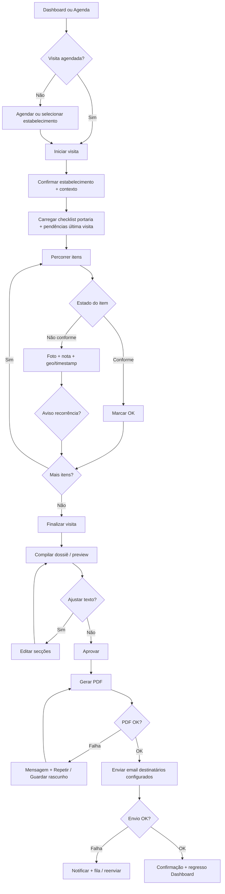

**Recuperação de erros:** falha de rede durante itens — *queue* ou mensagem **“Alterações guardadas localmente quando possível”** conforme arquitetura; falha PDF/email — estado visível na visita (**Pendente envio**) com CTA **Repetir**.

---

### Onboarding e primeiro uso (Maria)

**Objetivo:** conta criada, contexto de trabalho definido, dados migrados, primeiro valor percebido (ficha ou visita).

**Entrada:** *landing* / convite → **Criar conta** ou **Iniciar teste** (conforme comercial).

**Notas MVP:** sem *sandbox* demo (Etapa 1.5); **wizard + CSV + cadastro direto**.

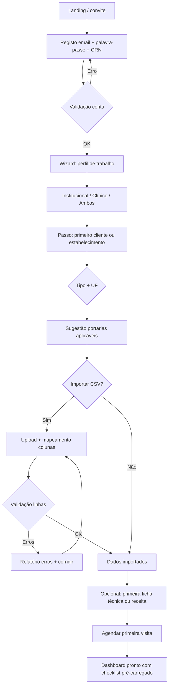

**Delight / eficiência:** após importação, **toast** com contagem de registos; sugestão de portarias **sem juridiquês** excessivo (“Para SP, usamos estes modelos”).

---

### Portal do cliente PJ (Dona Margarida / Carlos) — alvo Etapa 1.5

**Objetivo (futuro):** gestor vê conformidade, histórico e pacotes para fiscalização **sem** depender do nutricionista para cada PDF.

**MVP paralelo:** nutricionista envia **PDF por email**; o portal completo não bloqueia validação.

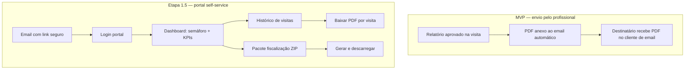

**UX:** linguagem **não técnica** nos rótulos; números com **contexto** (“85% face ao mês anterior”); ações principais sempre com verbo claro (**Baixar relatório**, **Gerar pacote**).

---

### Administração da plataforma (Diego)

**Objetivo:** operar SaaS — tenants, conteúdo regulatório versionado, métricas; evoluir para marketplace e *churn* (1.5/2).

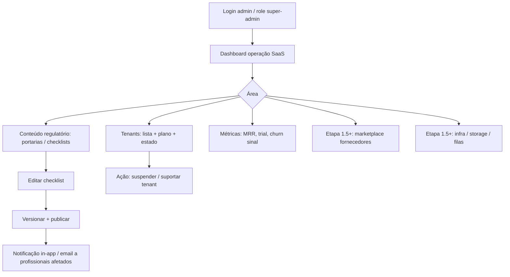

**MVP:** foco em **D + E + I** essenciais; ramos **J/K** documentados para não misturar escopo na primeira entrega.

---

### Journey Patterns

**Navegação**

- **Contexto sempre visível:** cabeçalho ou *breadcrumb* com **estabelecimento + data da visita** no modo execução; admin com **tenant** selecionado.
- **Saída segura:** *Finalizar* ou *Guardar rascunho* antes de abandonar checklist longo; confirmar só se houver alterações não guardadas.
- **Duas colunas no desktop** onde o PRD/UI spec já definem (login 50/50; listas de cardápio); **uma coluna + *sheet*** no mobile para detalhe sem perder lista.

**Decisão**

- **Binária onde possível:** Conforme / Não conforme; reduzir *dropdowns* no campo.
- **Progressive disclosure:** dossiê em *preview* colapsável por secção; admin regulatório — editar item dentro de modal ou página filha, não árvore infinita na mesma vista.

**Feedback**

- **Progresso:** itens `x / n` na visita; estados de PDF/email (**A gerar**, **Enviado**, **Falhou**).
- **Toasts** para ações rápidas (foto anexada); **banner persistente** para incidências que bloqueiam envio ou compliance.
- **Alertas do dashboard** com *countdown* e CTA única (**Ver checklist**, **Renovar contrato**).

---

### Flow Optimization Principles

1. **Menos passos até valor:** do *login* ao dashboard com agenda do dia em **poucos cliques**; da visita ao *preview* do relatório **sem sair do fluxo** (sem “exportar para Word” manual).
2. **Carga cognitiva:** uma decisão principal por ecrã no telemóvel; tabelas densas (ficha técnica, admin) reservadas a **desktop** ou *sheet* com zoom legível.
3. **Confiança:** toda foto mostra **miniatura + rótulo do item** no dossiê; recorrência de NC com **texto explicativo**, não só ícone.
4. **Erros:** mensagens **específicas** (“Falha ao gerar PDF: tente de novo”) + **sempre** uma ação primária (**Repetir**, **Guardar rascunho**, **Contactar suporte** no admin).
5. **Delight contido:** confirmação clara de **envio** e de **importação CSV**; evitar animações que atrasem o trabalho em campo (`prefers-reduced-motion`).
6. **Alinhamento direção visual (Passo 9):** fluxos críticos usam o mesmo *shell* (sidebar + cartões) para reforçar familiaridade entre dashboard, visita e relatório.

## Component Strategy

*Design system base: **shadcn/ui** + Radix + Tailwind (Passo 6). Abaixo: cobertura do catálogo, lacunas preenchidas com **componentes de domínio** compostos, e roadmap de implementação.*

### Design System Components

**Já previstos / reutilizáveis diretamente (shadcn + Lucide):**

| Área | Componentes | Uso no produto |
|------|-------------|----------------|
| **Formulários** | `Input`, `Label`, `Textarea`, `Select`, `Checkbox`, `RadioGroup`, `Switch`, `Form` (react-hook-form) | Login, registo CRN, perfil, toggles de preferências, filtros admin |
| **Ações** | `Button`, `DropdownMenu`, `Tooltip` | CTAs primários/secundários, menus de contexto em listas |
| **Superfícies** | `Card`, `Separator`, `ScrollArea`, `Tabs` | Dashboard KPIs, secções de ficha técnica, separação Pacientes / Financeiro |
| **Sobreposição** | `Dialog`, `Sheet`, `Popover`, `AlertDialog` | Confirmações, *drawer* mobile para detalhe, date-picker |
| **Dados** | `Table`, `Badge`, `Skeleton`, `Progress` | Ficha técnica (desktop), estados de carregamento, progresso `x/n` na visita |
| **Feedback** | `Toast` / Sonner, `Alert` | Fotos anexadas, erros de PDF/email, avisos regulatórios |
| **Navegação** | `Sidebar` (ou layout custom), `Breadcrumb`, `Command` (opcional) | *Shell* logado, admin |

**Gráficos:** biblioteca à escolha na story de dashboard (**Recharts**, **Chart.js**, etc.) — componentes de *chart* como **wrappers** que consomem tokens/cores do tema (Passo 9).

**Lacunas (não são “um só” no catálogo):** execução de visita com evidência por item, cascata de custos na ficha técnica, importador CSV com mapeamento, pré-visualização do dossiê — tratados como **componentes custom** compostos.

---

### Custom Components

#### ChecklistItemVisit (linha de item de visita)

**Propósito:** Um item regulatório com estado de conformidade, evidência (foto/nota) e aviso de recorrência.

**Utilização:** Modo execução de visita (mobile-first); lista virtualizável se portarias muito longas.

**Anatomia:** Número/código do item + título; grupo opcional (*accordion* por secção); zona de estado (**Conforme** / **Não conforme**); miniaturas de fotos + **dois CTAs explícitos**: **Tirar foto** (input `capture="environment"` para abrir câmara em telemóvel/tablet) e **Galeria** (sem `capture`, para ficheiros já guardados ou *picker* em desktop); *textarea* colapsável para nota; *badge* ou *inline alert* “Recorrente (n visitas)”.

**Estados:** Colapsado / expandido; conforme; não conforme (com ou sem foto obrigatória conforme regra); *disabled* durante *sync*; erro de upload com retry.

**Variantes:** Compacto (só ícones + contador) vs expandido (teclado aberto para notas).

**Acessibilidade:** `role` adequado por controlos Radix; botão de câmara com `aria-label`; anunciar mudança de estado para leitores de ecrã; foco visível em toggles.

**Conteúdo:** Texto do item copiável da portaria; não truncar critério legal crítico sem “ver mais”.

**Interação:** Toque no item expande; captura de foto associa **sempre** ao `itemId` atual; swipe opcional futuro (não MVP).

---

#### VisitExecutionHeader (cabeçalho de contexto da visita)

**Propósito:** Manter **estabelecimento, data e progresso** visíveis durante toda a execução.

**Utilização:** Topo fixo ou *sticky* abaixo da *app bar*.

**Anatomia:** Nome do estabelecimento + tipo; data/hora; `Progress` ou texto `12/40`; *badge* de rascunho; menu “…” (*Guardar e sair*, *Ajuda*).

**Estados:** Normal; offline/indisponível (MVP: mensagem “requer rede”); rascunho não sincronizado.

**Acessibilidade:** Região `header` com título programático; progresso com `aria-valuenow` / `aria-valuemax` se usar barra.

---

#### DossierPreview (pré-visualização do relatório)

**Propósito:** Secções colapsáveis do dossiê antes de aprovar (checklist, evidências, recomendações).

**Utilização:** Após **Finalizar visita**, antes de **Aprovar** e gerar PDF.

**Anatomia:** `Accordion` ou lista de `Card` por secção; galeria de fotos com legenda = referência ao item; *inline edit* leve para observações finais.

**Estados:** Carregamento; vazio (nenhuma foto — aviso); erro de geração de pré-visualização.

**Acessibilidade:** Cabeçalhos de secção em hierarquia correta; imagens com `alt` descritivo ou `alt` vazio se puramente decorativas (preferir texto adjacente ao item).

---

#### TechnicalSheetIngredientRow (linha de ingrediente)

**Propósito:** Ingrediente, quantidade, unidade, custo unitário, ligação TACO e participação no custo da receita.

**Utilização:** Editor de ficha técnica (desktop preferencial); repetição em lista editável.

**Anatomia:** Células alinhadas (tabular nums); *combobox* ou busca para ingrediente/TACO; campos numéricos; ícone de aviso se custo desatualizado após cascata.

**Estados:** Default; erro de validação por campo; linha bloqueada durante recálculo global.

**Acessibilidade:** Labels associados; anunciar “Total atualizado” após cascata se ação batch.

---

#### CostSummaryPanel (resumo de custos e margem)

**Propósito:** Custo total, impostos, margem %, preço por porção, totais nutricionais por porção — leitura densa num só bloco.

**Utilização:** Coluna lateral ou cartão no fim da ficha técnica.

**Anatomia:** Grelha de métricas; destaque para **preço sugerido**; link “Como calculamos” (*popover* com regra).

**Estados:** Calculando (*skeleton*); divergência (ex. ingrediente sem preço).

---

#### AgendaVisitBlock (bloco de visita na agenda)

**Propósito:** Card/lista de visita com prioridade, CTA **Iniciar** / **Ver detalhe**, indicadores de NC pendente.

**Utilização:** Dashboard e vista calendário/semana (referência `agendamento-visitas`).

**Anatomia:** Hora; estabelecimento; *badges* opcionais; alinhado aos pastéis do Passo 8.

**Interação:** Clicável em toda a área ou CTA explícito; respeitar alvo mínimo ~44px.

---

#### DashboardAlertCard (alerta com *countdown*)

**Propósito:** Alertas regulatórios e financeiros com urgência e **uma** CTA.

**Utilização:** Colunas Pacientes / Financeiro no dashboard.

**Anatomia:** Título; subtítulo com prazo; CTA; cor semântica + ícone (nunca só cor).

**Acessibilidade:** `aria-live="polite"` para atualização de contagem se regressiva em tempo real.

---

#### CsvImportMapper (assistente de importação)

**Propósito:** Upload, pré-visualização de colunas, mapeamento para campos do modelo, relatório de erros por linha.

**Utilização:** Onboarding e migração (Jornada 2).

**Anatomia:** *Dropzone*; `Table` de pré-visualização; `Select` por coluna de origem → campo destino; lista de erros com *link* para linha.

**Estados:** Ficheiro inválido; parcialmente importado; sucesso com resumo.

**Acessibilidade:** Anunciar resultado da validação; foco no primeiro erro.

---

#### RegulatoryVersionBanner (admin — nova versão publicada)

**Propósito:** Após publicar checklist, informar profissionais afetados; no admin, mostrar estado *draft* vs *published*.

**Utilização:** Fluxo Diego — conteúdo regulatório.

**Anatomia:** `Alert` + versão + data; CTA *Ver alterações*.

---

### Component Implementation Strategy

1. **Composição primeiro:** implementar custom com **primitivos shadcn** (Card, Button, Accordion, Table) + tokens Tailwind (`bg-card`, `text-muted-foreground`, `--radius`).
2. **Contratos de dados:** props estáveis (`itemId`, `status`, `attachments[]`) para facilitar testes e *storybook* opcional.
3. **Partilha NutriGestão vs Admin:** componentes de **domínio clínico** em `components/domain/` (ou equivalente); UI genérica em `components/ui/`.
4. **Acessibilidade:** herdar padrões Radix; rever foco em fluxos custom (câmara, *sheet* de foto).
5. **Performance:** listas longas de checklist — virtualização na story se métricas o exigirem; tabela ficha técnica — *sticky* header no desktop.

---

### Implementation Roadmap

**Fase 1 — MVP (fluxos críticos)**

| Prioridade | Componente / conjunto | Liga à jornada |
|------------|----------------------|----------------|
| P0 | *Shell* (sidebar + header) + páginas auth | Todas |
| P0 | `VisitExecutionHeader` + `ChecklistItemVisit` | Visita técnica |
| P0 | `DossierPreview` + estados PDF/email | Visita técnica |
| P0 | `DashboardAlertCard` + cartões KPI | Dashboard |
| P0 | `AgendaVisitBlock` | Agenda / dashboard |
| P1 | `CsvImportMapper` | Onboarding |
| P1 | `TechnicalSheetIngredientRow` + `CostSummaryPanel` | Ficha técnica |
| P1 | Tabelas admin (tenants, checklists) com `Table` + `Badge` | Admin Diego |

**Fase 2 — Suporte e densidade**

- POPs vinculados, financeiro (contratos/recorrência), listagens de clientes com filtros avançados.
- *Charts* encapsulados (`DashboardChartCard`) com paleta do tema.
- Portal externo básico: reutilizar `Card`, `Alert`, listagens de relatórios (variantes de `AgendaVisitBlock` ou lista simples).

**Fase 3 — Etapa 1.5+**

- Portal PJ: `ComplianceGauge` (semáforo + tendência), `AuditPackageTrigger`.
- Marketplace admin: galeria de fornecedores (extensão de tabelas + *drawers*).
- Modo offline / áudio: novos estados em `ChecklistItemVisit` e fila de *sync* (UI de fila, não neste MVP).

Este roadmap prioriza **visita → relatório** e **onboarding com CSV**, depois **ficha técnica** e **admin**, alinhado ao PRD Fase 1.

## UX Consistency Patterns

*Padrões transversais para NutriGestão, alinhados a **shadcn/ui**, jornadas (Passo 10) e componentes de domínio (Passo 11). Objetivo: previsibilidade entre área logada, visita em campo e admin.*

### Button Hierarchy

**Quando usar:** sempre que houver mais de uma ação num ecrã ou cartão.

**Visual:** **Primário** (`Button` default) — uma ação por vista que avança o fluxo principal (*Entrar*, *Iniciar visita*, *Aprovar relatório*, *Guardar ficha*). **Secundário** (`variant="outline"` ou `secondary`) — cancelar sem perda, *voltar*, *Ver detalhe*. **Terciário** (`variant="ghost"` ou link estilizado) — *Esqueci a palavra-passe*, *Ver mais*, acções na linha de tabela. **Destrutivo** (`variant="destructive"`) — eliminar visita rascunho, revogar convite; sempre com **confirmação** (`AlertDialog`).

**Comportamento:** ordem visual PT: primário à **direita** em *footer* de diálogos (desktop); em *full-width* mobile, primário **abaixo** do secundário se o secundário for “cancelar sem guardar”. *Loading* no próprio botão com `disabled` e texto ou *spinner* — não duplicar CTA.

**Acessibilidade:** `aria-busy` quando aplicável; foco não saltar ao terminar *submit* (devolver foco ao primeiro erro ou à confirmação).

**Mobile:** altura mínima confortável (~44px) em **Iniciar visita**, **Tirar foto**, **Finalizar visita**.

**Variantes:** ícone só (`size="icon"`) apenas quando o significado for óbvio (olho mostrar senha) + `aria-label`.

---

### Feedback Patterns

**Quando usar:** resultado de ação, estado de sistema, urgência regulatória ou financeira.

**Visual:** **Sucesso** — *toast* curto (Sonner/`toast`) para *guardado*, *foto anexada*, *email enviado*; não bloquear. **Erro** — *toast* ou `Alert` **inline** no fluxo se a ação for crítica (PDF falhou → CTA *Repetir* na própria área da visita). **Aviso** — `Alert` com `variant` semântico + ícone; *banner* no topo se bloquear envio (ex. checklist incompleto). **Info** — texto `muted` ou `Alert` neutro; countdown de portaria no **DashboardAlertCard** (Passo 11).

**Comportamento:** mensagens **específicas** (“Não foi possível gerar o PDF. Tente novamente.”) em vez de genéricas; *toast* de sucesso desaparece sozinho; erros persistentes até ação do utilizador ou correção.

**Acessibilidade:** `role="status"` / `aria-live="polite"` para *toasts*; erros de formulário ligados com `aria-describedby`; alertas urgentes `aria-live="assertive"` só quando indispensável.

**Mobile:** *toasts* não cobrir o botão primário fixo inferior; posição preferencial topo ou acima da *safe area*.

**Variantes:** fila assíncrona (PDF a gerar) — *badge* ou linha de estado na visita, não só *toast* efémero.

---

### Form Patterns

**Quando usar:** login, registo CRN, cadastros, ficha técnica, admin CRUD, importação CSV.

**Visual:** `Label` sempre visível (não só *placeholder*); agrupar campos relacionados com espaçamento 8px; secções longas com `Card` ou cabeçalhos `h2`/`h3`.

**Comportamento:** validação **on blur** ou *on submit* para campos simples; **on change** só quando feedback imediato ajuda (força de senha, mapeamento CSV). Um resumo de erros no topo em formulários longos (*wizard*) com *links* para o primeiro campo inválido.

**Acessibilidade:** `htmlFor` / `id`; primeiro erro focável; não desabilitar *submit* sem explicar (preferir *submit* + mensagens).

**Mobile:** `font-size` mínimo **16px** em inputs para evitar *zoom* iOS; teclado numérico para quantidades/custos (`inputMode`).

**Variantes:** *wizard* onboarding — indicador de passo (ex. “Passo 2 de 4”); admin — tabelas com edição inline opcional, preferir linha + *sheet* se muitos campos.

---

### Navigation Patterns

**Quando usar:** *shell* logado, troca de módulos, saída da visita, admin.

**Visual:** sidebar com item **ativo** com primário (Passo 8/9); *breadcrumb* em páginas profundas (ficha técnica → receita → ingrediente) quando útil.

**Comportamento:** **contexto da visita** no cabeçalho *sticky* (Passo 11); sair do checklist com **Guardar rascunho** ou `AlertDialog` se houver alterações. *Deep links* de email (portal 1.5) abrem rota pública/autenticada conforme token.

**Acessibilidade:** *skip link* “Saltar para conteúdo”; ordem de foco: sidebar → conteúdo; modais prendem foco (Radix).

**Mobile:** sidebar em `Sheet`; lista principal mantém-se; detalhe em segunda superfície (*sheet* ou página dedicada).

**Variantes:** admin — *subnav* por área (Tenants / Regulatório / Métricas) com `Tabs` ou secção lateral estreita.

---

### Additional Patterns

#### Modais e overlays

**Quando usar:** confirmações destrutivas, edição rápida sem perder lista, captura auxiliar.

**Regra:** `Dialog` no desktop para confirmações; `Sheet` **de baixo ou lateral** no mobile para filtros e detalhe. Evitar *dialog* sobre *dialog*; preferir passo único ou *wizard* interno.

**Acessibilidade:** fechar com Esc; foco no primeiro campo focável ou no botão cancelar conforme criticidade.

#### Estados vazios e carregamento

**Vazio:** ilustração ou ícone leve + uma frase + **uma** CTA (*Agendar primeira visita*, *Importar CSV*). Sem culpa (“Ainda não há visitas” vs “Erro”).

**Carregamento:** `Skeleton` na mesma forma do conteúdo final (cartões dashboard, linhas de tabela); *spinner* só em botões ou áreas pequenas.

**Acessibilidade:** `aria-busy` no contentor; *skeleton* não deve ser confundido com dados reais em leitores — região com `aria-label="A carregar"`.

#### Pesquisa e filtros

**Quando usar:** listas de clientes, estabelecimentos, POPs, admin tenants.

**Comportamento:** *debounce* na pesquisa; filtros aplicados mostrados como *chips* removíveis; *Clear all* visível. Em mobile, filtros num `Sheet` acionado por botão **Filtros** com *badge* de contagem.

**Consistência:** mesma posição (topo da lista) e mesma densidade entre módulos.

---

### Integração com o design system

- Os padrões acima mapeiam para **`Button`**, **`Alert`**, **`Dialog`/`Sheet`**, **`Form`**, **`toast`**, **`Skeleton`**, **`Badge`** — sem inventar novos primitivos salvo necessidade de domínio (Passo 11).
- **Tokens:** cores semânticas (`destructive`, `muted`) e `--radius` garantem que um ecrã “saúde” e outro “admin” pareçam o mesmo produto.
- **Regras custom NutriGestão:** (1) ações que **fecham visita** ou **enviam a cliente** exigem confirmação ou *preview* explícito; (2) feedback de **compliance** inclui sempre texto ou ícone além da cor; (3) listas críticas (checklist) não escondem estado de *sync* ou erro de rede atrás de *toast* apenas — manter indicador na `VisitExecutionHeader` ou na linha do item.

## Responsive Design & Accessibility

*Alinhado ao PRD (web responsiva **375px–1920px**, **WCAG 2.1 AA**) e ao Passo 3 (mobile-first em campo, desktop para tarefas densas).*

### Responsive Strategy

**Desktop (≥1024px)**

- **Sidebar fixa** visível; conteúdo principal com **largura máxima** confortável onde fizer sentido (evitar linhas de texto infinitas em relatórios).
- **Multi-coluna:** dashboard (KPIs em grelha); ficha técnica com **tabela larga + painel de resumo** lado a lado; login **50/50** (Passo 6).
- **Densidade:** tabelas admin, ingredientes e custos com mais colunas visíveis; *sticky* header em tabelas longas.

**Tablet (768px–1023px)**

- Tratar como **touch-first**: mesma hierarquia que mobile, com mais **área horizontal** para duas colunas de cartões no dashboard quando couber.
- Sidebar **colapsável** ou `Sheet` conforme padrão do *shell*; evitar hover como único meio de revelar ações críticas.

**Mobile (320px–767px, alvo mínimo 375px)**

- **Prioridade:** visita do dia, alertas urgentes, **Iniciar visita**, progresso do checklist — acima da dobra quando possível.
- **Navegação:** *hamburger* / ícone menu → `Sheet` com mesma árvore da sidebar; **sem** *bottom bar* fixa obrigatória no MVP (reduz conflito com teclado e câmara) — reavaliar se métricas pedirem atalhos globais.
- **Layouts:** uma coluna; detalhe (foto, nota longa) em **página completa** ou `Sheet`; gráficos do dashboard empilhados com *scroll* vertical.
- **Teclado virtual:** reservar espaço para CTAs fixos inferiores sem sobrepor campos (`safe-area-inset-bottom`).

### Breakpoint Strategy

**Abordagem:** **mobile-first** com media queries Tailwind (`sm` / `md` / `lg` / `xl`), alinhadas aos defaults do projeto salvo ajuste documentado.

| Token (Tailwind) | Largura aproximada | Uso NutriGestão |
|------------------|-------------------|-----------------|
| *default* | &lt; 640px | Lista + *sheet*; visita *full screen*; KPIs empilhados |
| `sm` | ≥ 640px | Grelhas 2 colunas leves; alguns formulários em duas colunas |
| `md` | ≥ 768px | Sidebar pode tornar-se persistente ou layout *two-pane* leve |
| `lg` | ≥ 1024px | Sidebar fixa; ficha técnica *table + painel*; admin denso |
| `xl` | ≥ 1280px | Mais colunas em dashboards analíticos; *max-width* do conteúdo |

**Casos de uso críticos:** testar explicitamente **375px** (iPhone SE) na **execução de visita** e **768px** na **transição** lista ↔ detalhe.

### Accessibility Strategy

**Nível alvo:** **WCAG 2.1 nível AA** (requisito do PRD) — não substituir por “esforço razoável” sem registo de exceção.

**Contraste:** texto normal **4.5:1**; texto grande / componentes gráficos UI **3:1** onde aplicável; **validar** texto sobre cartões pastéis (KPI) e estados primários.

**Teclado:** todas as funções disponíveis sem rato; ordem de foco lógica; **sem *trap* de foco** fora de modais (Radix); *Esc* fecha *overlay* documentado.

**Leitores de ecrã:** HTML semântico (`main`, `nav`, `header`, cabeçalhos hierárquicos); `aria-label` / `aria-describedby` em ícones e erros; estados de *toggle* e progresso comunicados.

**Toque:** alvos **mínimo ~44×44px** em ações críticas (câmara, concluir item, guardar) — já referido nos Passos 8 e 12.

**Não depender só da cor:** conformidade, alertas e gráficos com **texto ou padrão** complementar (Passo 8).

**Motion:** respeitar **`prefers-reduced-motion`** em transições e *toasts*.

**Conteúdo sensível (saúde):** linguagem clara em consentimentos e erros; não expor dados clínicos em mensagens de *toast* genéricas.

### Testing Strategy

**Responsivo**

- Viewports: **375**, **390**, **768**, **1024**, **1280**, **1920**; orientação retrato/paisagem em visita e captura de foto.
- Browsers: **Chrome**, **Safari** (iOS/macOS), **Firefox**, **Edge** — pelo menos um ciclo por *release* significativo.
- Rede: **3G lento** ou *throttling* ao testar upload de fotos e geração de PDF.

**Acessibilidade**

- Automático: **axe** ou equivalente no CI / pré-commit em páginas-chave; **Lighthouse** acessibilidade como sinal, não única prova.
- Manual: percurso **só teclado** (login → dashboard → iniciar visita → um item → sair); **VoiceOver** (Safari/iOS) e **NVDA** ou **VoiceOver** (Windows/Chrome) em fluxo crítico.
- Contraste: ferramenta sobre **tema real** (claro; *dark* se ativado).
- Simulação: **daltonismo** em gráficos e *badges* de estado.

**Utilizadores**

- Incluir, quando possível, **1 sessão** com utilizador que use zoom do SO ou leitor; validar com **dispositivo real** em campo (brilho solar, luvas — *nice-to-have*).

### Implementation Guidelines

**CSS / layout**

- Preferir **rem** / tokens Tailwind; evitar larguras fixas em *px* para conteúdo fluido.
- Imagens responsivas (`sizes`, formatos modernos); *lazy load* abaixo da dobra.
- Áreas de toque com **padding** invisível se o ícone for pequeno (`min-h`, `min-w`).

**Acessibilidade no código**

- Componentes Radix/shadcn: não remover **roles** implícitos; foco ao abrir `Dialog`/`Sheet`.
- Formulários: associar erros com **`aria-invalid`** e **`aria-describedby`**.
- *Skip link* no *layout* raiz: primeiro foco tabulável.
- Vídeos/áudio (futuro): legendas/transcrições antes de feature pública.

**Checklist rápido por PR**

- [ ] Contraste AA nos estados novos (default, hover, focus, disabled)
- [ ] Foco visível em custom *focus-visible*
- [ ] Nenhuma informação crítica só por `title` ou cor
- [ ] Lista/checklist usável com teclado onde há alternativa ao toque

Esta secção complementa os **NFRs** do PRD e deve ser verificada na **Definition of Done** das *stories* de UI.

## Workflow UX — conclusão

O workflow **BMad Create UX Design** está **concluído** (`lastStep: 14`, `uxDesignCompletedAt` no *frontmatter*). O estado é espelhado em **`_bmad-output/workflow-status.yaml`** (`workflows.create-ux-design`).

### Entregáveis do spec (checklist Passo 14)

- [x] Resumo executivo e entendimento do projeto
- [x] Experiência central e resposta emocional
- [x] Análise de padrões UX e inspiração (+ referências `ux-references/`)
- [x] Design system (shadcn) e estratégia de implementação
- [x] Mecânicas de interação (Core UX afiado)
- [x] Fundação visual (cor, tipografia, espaçamento, a11y base)
- [x] Decisão de direção de design + explorações visuais
- [x] Jornadas com fluxos (Mermaid) e padrões de jornada
- [x] Estratégia de componentes e especificações *custom*
- [x] Padrões de consistência UX (botões, feedback, formulários, navegação)
- [x] Responsivo e acessibilidade (estratégia + testes + guias)

### Artefactos de apoio (caminhos relativos à raiz do repositório)

| Artefacto | Caminho |
|-----------|---------|
| **Especificação UX (este ficheiro)** | `_bmad-output/planning-artifacts/ux-design-specification.md` |
| **Direções de design (mockups A–F)** | `_bmad-output/planning-artifacts/ux-design-directions.html` |
| **Temas de cor (tokens semânticos)** | `_bmad-output/planning-artifacts/ux-color-themes.html` |
| **HSL shadcn — Direção A (ref.)** | `_bmad-output/planning-artifacts/theme-nutri-ref-a.css` |
| **HSL shadcn — Teal (preferido)** | `_bmad-output/planning-artifacts/theme-nutri-teal.css` |
| **Referências visuais (PNG)** | `_bmad-output/planning-artifacts/ux-references/` |
| **Estado do workflow BMad** | `_bmad-output/workflow-status.yaml` |

Abrir os ficheiros `.html` no browser para revisão com *stakeholders*. O visualizador de **temas** complementa o Passo 8: mapear cores mostradas para `hsl()` no tema shadcn e validar **WCAG AA** antes do *launch*.

### Próximos passos sugeridos

1. **`bmad-check-implementation-readiness`** — PRD + UX + arquitetura alinhados.  
2. **`bmad-create-epics-and-stories`** ou **`bmad-quick-dev`** — desdobrar em entregáveis.  
3. **Wireframes / protótipo / Figma** — conforme necessidade de validação visual.  
4. **`bmad-help`** — pergunta “o que fazer a seguir?” para orientação no catálogo BMad.
